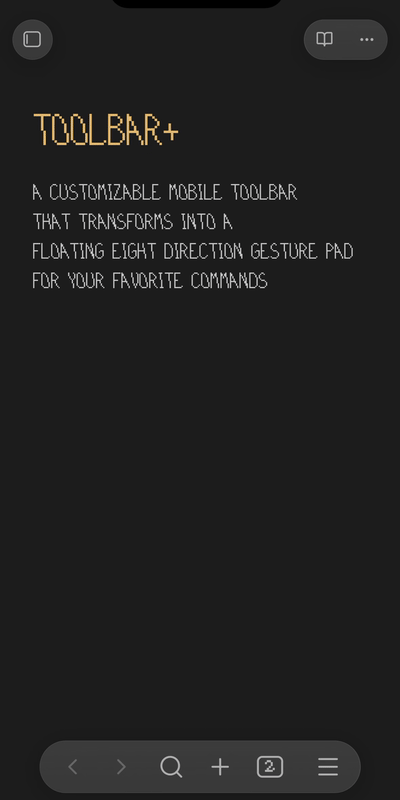

# toolbar+

A customizable mobile toolbar that detaches into an eight-direction gesture pad.

**Flick down on the nine-dot handle while docked to hide the keyboard.** No need to hold first. The toolbar stays docked and returns when you reopen the keyboard.

## How to use it

Open a Markdown note and bring up the keyboard to see the toolbar.

- **Tap a toolbar button** to run its command.
- **Tap the nine-dot handle** to customize buttons, icons, and gestures.
- **Hold the docked handle, then drag** to detach it and place the floating control.
- **Flick the floating handle in a direction** and release to run its command. Return to the center before releasing to cancel.
- **Hold the floating handle, then drag to the bottom target** and release to dock it again.

## Default floating gestures

| ↖ Undo         | ↑ Command palette    | ↗ Redo     |
| -------------- | -------------------- | ---------- |
| ← Previous tab | • Handle / configure | → Next tab |
| ↙ Copy         | ↓ Toggle keyboard    | ↘ Paste    |

Choose any available Obsidian or community-plugin command. **Settings → toolbar+** controls the gesture grid, vibration, hold duration, and flick distance. Enable **Show on desktop** there to use it with a mouse or trackpad.

The Command Palette also offers **Dock toolbar**, **Float gesture control**, and **Insert alias**, which wraps selected text in `[[|selected text]]` so you can choose the linked note.

Requires Obsidian **1.13.7+**. Version **0.1.20** is verified on iPhone; Android is untested.

Licensed under [MPL 2.0](LICENSE).
